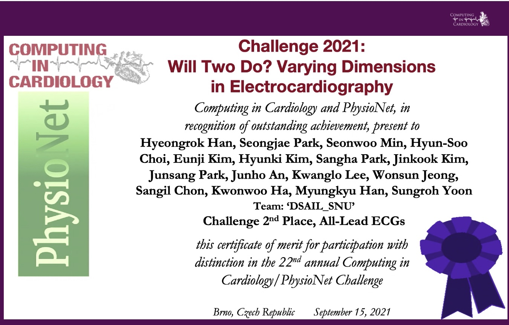
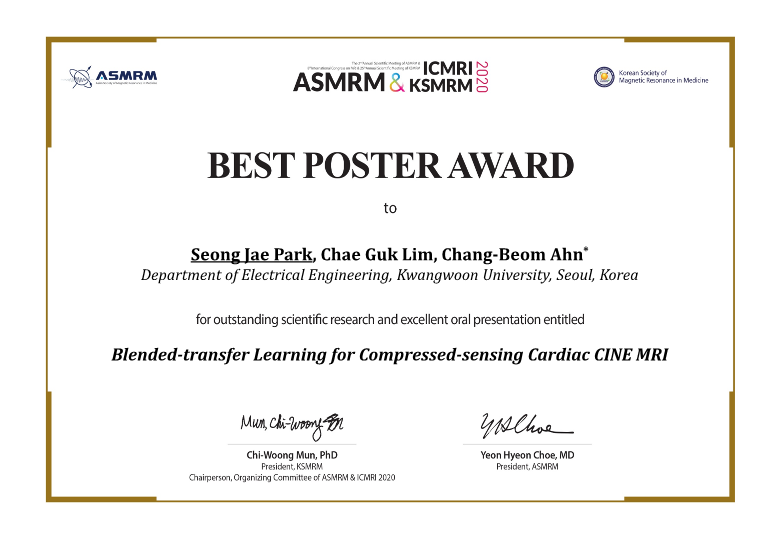

<h1>Award</h1>

## CinC & PhysioNet Challenge
> Keywords - `Knowledge distillation`, `Multi-label classification`, `Asymmetric loss`, `Mixup`

- ECG로부터 총 30개의 부정맥을 찾는 global 대회
- 12 leads signal 및 특정 subset (2, 3, 4, 6 leads) 만을 사용하여 부정맥을 탐지해야 함 → 총 5개 부문
- 다양한 국가, 환자 특성, 신호 특성이 섞인 dataset으로부터 bias되지 않은 model을 만들어야 함
 
<aside>
💡 종합 2위

- 1st prize : 3, 4 leads
- 2nd prize : 2, 6, 12 leads
</aside>
  

## ASMRM & ICMRI & JSMRM
### Title: Blended-transfer learning for cardiac CINE MRI.
> Keywords - `Transfer learning`, `Catastrophic forgetting`, `Generalization`

- Sparse sensing으로 인한 image 품질 저하를 개선하는 연구
- Transfer learning을 통해 학습 가속화 및 model의 일반화 및 성능 향상
- Catastrophic forgetting problem을 보완하는 blended-transfer learning 기법 제안
 
<aside>
💡   

- Training from scratch 기준 학습시간 100배 가속
- Source data에 대한 성능 보존 및 Target data에 대한 성능 최대 8% 향상
</aside>
  

## KSIST
> Keywords - `Transfer learning`, `Generalization`
- Sparse sensing으로 인한 image 품질 저하를 개선하는 연구
- Transfer learning을 통해 학습 가속화 및 model의 일반화 및 성능 향상
  
  

# Patent

## SYSTEM AND METHOD OF GENERATING MAGNETIC RESONANCE IMAGE USING DEEP ARTIFICIAL NEURAL NETWORK
### DOI: https://doi.org/10.8080/1020200008807
> Keywords - `3D reconstruction`, `Fourier transform`
- 주어진 k-space data로부터 고품질 영상을 재구성하는 MRI 기법
- Data acquisition 시 xy-plane(`axial plane`)의 resolution에 비해 z-axis resolution(`thickness`)이 상대적으로 sparse하다는 점에서 착안.
- 3D reconstruction을 위해 여러 axial image를 재구성하는 대신 sagital or coronal image를 재구성하는 방식.
- 이 때 신경망을 사용하여 low resolution을 보완함.
  
